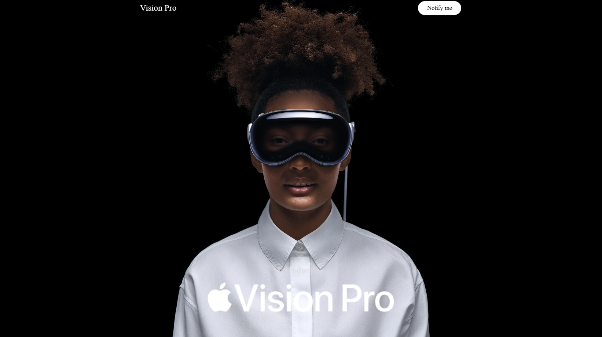

# Apple Website Clone

Click here to visit the page [AppleClonebyOm](https://appleclonebyom.netlify.app/)
This project is a clone of the Apple website built using HTML, CSS, and JavaScript. It aims to replicate the layout, design, and functionality of the official Apple website as a learning exercise and showcase of front-end development skills.

## Preview

Include screenshots or gifs showcasing the cloned website here.

## Features

- **HTML/CSS:** Utilized to create the structure and style the elements of the website.
- **JavaScript:** Used for interactive elements and enhancing user experience.
- **Responsive Design:** Ensured the website is accessible and looks good across various devices.
- **Navigation:** Implemented menu bars, dropdowns, and links to mimic the original website's navigation.
- **Content Sections:** Created sections for products, news, and other content as found on the Apple website.

## How to Use

1. Clone this repository to your local machine.
2. Open the `index.html` file in your web browser to view the cloned website.
3. Explore the different pages and functionalities to see the replicated content.

## Technologies Used

- HTML
- CSS
- JavaScript

## Acknowledgements

The project was inspired by the design and layout of the official [Apple website](https://www.apple.com/) and aims to mimic its appearance and behavior.

## Contributing

Contributions are welcome! Feel free to fork the repository and submit pull requests to suggest improvements or additional features.

## License

This project is licensed under the [MIT License](link_to_license_file).
